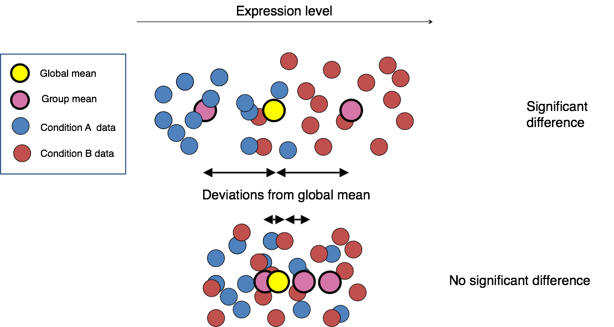

<!--- Allow the page to be wider --->
<style>
    body .main-container {
        max-width: 1200px;
    }
</style>
> # Objectives 
> * Generate tables of DE results
> * Understand what a p-value represents.   
> * Understand  multiple hypothesis correction and importance    
> * Understand advantages of using gene ids when analyzing data.    
> * Given a list of Ensembl gene ids, add gene symbols and Entrez accessions.    

```{r Modules, eval=TRUE, echo=FALSE, message=FALSE, warning=FALSE}
library(DESeq2)
library(tidyr)
load("RunningData.RData")
```

# Generating DE results table

Now that we have reviewed the plots by sample and determined that 

This illustration from the HCB training materials illustrates the differential expression procedure, where we are comparing the distribution of expression of a gene across samples in each treatment groups. 

*Image credit: Paul Pavlidis, UBC*

Only where the distributions of each group are sufficiently seperated will a gene be considered differentially expressed. This is where having sufficient replicates are important, as the more replicates we have in each group the better we can determine the distributions of expression for each group. 

## Results function

We have already fit our DESeq2 model, specifing our model as `~ condition`. We can check what comparisons were automatically generated during fitting using the `resultsNames()` and select a comparison of interest using the `results` function. 
```{r Results}
resultsNames(dds)
Comparison <- "condition_Mov.KD_vs_Irrel"
res <- results(dds, name=Comparison)
```
Looks like expected output for DESeq2 so just need to confirm that analysis approach is correct for having paired sample effects included in analysis.

```{r AdditionalComparisons}
res <- results(dds, c("batch", "two", "three")) # how to get comparisons that aren't part of named results
head(res)
```

## How do contrasts work

## Results table - review of output columns

### Multiple hypothesis testing and FDR correction

# How to annotate the results table

[Accessing BioMart](https://bioconductor.org/packages/release/bioc/vignettes/biomaRt/inst/doc/accessing_ensembl.html)


# Sources Used:    
* HBC DGE training module, part 1: https://hbctraining.github.io/DGE_workshop/lessons/04_DGE_DESeq2_analysis.html    
* HBC DGE training module, part 2: https://hbctraining.github.io/DGE_workshop/lessons/05_DGE_DESeq2_analysis2.html    
* DESeq2 vignette: http://bioconductor.org/packages/devel/bioc/vignettes/DESeq2/inst/doc/DESeq2.html#differential-expression-analysis    
* 

---

# Session Info:
```{r SessionInfo}
sessionInfo()
```

---

These materials have been adapted and extended from materials listed above. These are open access materials distributed under the terms of the [Creative Commons Attribution license (CC BY 4.0)](http://creativecommons.org/licenses/by/4.0/), which permits unrestricted use, distribution, and reproduction in any medium, provided the original author and source are credited.