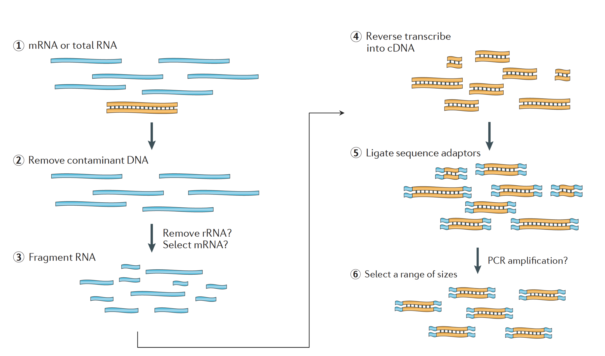
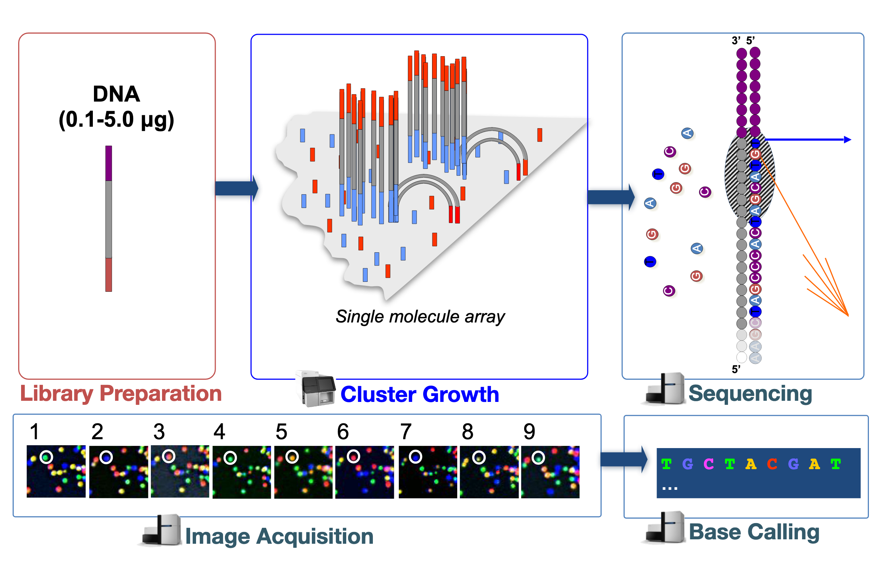

<!---
library(rmarkdown)
render('Module3a_Design_Prep_Seq_Slides.Rmd', output_dir = '~/Desktop')
--->

## Objectives

- Introduce the overall differential expression workflow.
- Understand the importance of replicates and batch effects.
- Introduce different types of library preps, and their requirements.
- Introduce how sequencing works.
- Understand how to estimate how many reads are needed for an experiment.

## Transcriptomics

- RNA-seq measures the transcriptome, the biological material in the cell arising from transcription. It has many uses:
    - Differential gene expression: a *quantitative* evaluation and comparison of transcript levels between groups of samples.
    - Transcriptome assembly: a *qualitative* profile of transcribed regions of the genome.
    - Construct better gene models.
    - Metatranscriptomics or community transcriptome analysis.

## Differential Expression Workflow

| Step | Task |
| :--: | ---- |
| **1** | **Experimental Design** |
| **2** | **Biological Samples / Library Preparation** |
| **3** | **Sequence Reads** |
| 4 | Assess Quality of Raw Reads |
| 5 | Splice-aware Mapping to Genome |
| 6 | Count Reads Associated with Genes |
| 7 | Test for DE Genes |

# Experimental Design and Practicalities

## Replicates

{ width=70% }

[Source: EBI](https://www.ebi.ac.uk/training-beta/online/courses/functional-genomics-ii-common-technologies-and-data-analysis-methods/rna-sequencing/performing-a-rna-seq-experiment/design-considerations/number-of-replicates/)

## Batch Effects

- Batch effects are introduced when groups of samples are handled in distinct ways. This can take many forms:
    - Processing case samples on Monday and control samples on Tuesday.
    - Having one student process case samples and another process control samples.
    - Running a group of samples on one type of sequencer and another group of samples on another.
- As much as possible, treat all samples the same, and never confound with case and control.

## Library Types

- The [Univeristy of Michigan Advanced Genomics Core (AGC)](https://brcf.medicine.umich.edu/cores/advanced-genomics/) has [recommendations](https://brcf.medicine.umich.edu/cores/advanced-genomics/sample-requirements/) for starting amounts and quality.

| Preparation Type | RNA Measured | Recommended |
| ---------------- | ------------ | ----------- |
| polyA | mRNA | Typical for DE analysis. |
| Total RNA | mRNA and long-noncoding RNA | Interested in other RNA types. Organism lacks polyA, e.g. bacterial DNA|
| QuantSeq | mRNA | Cost-effective microarray replacement. Good for low RIN scores. |

## RNA Integrity Number

- Essentially a ratio of 28S to 16S ribosmal RNA that measures the degradation of the RNA.
- Scale of 0 (very degraded) to 10 (not degraded).
- AGC also has [recommendations](https://brcf.medicine.umich.edu/cores/advanced-genomics/sample-requirements/) for RIN scores for different library preparation types.

## Preparation

{ width=80% }

http://rnaseq.uoregon.edu/#rna-prep and Martin J.A. and Wang Z., Nat. Rev. Genet. (2011) 12:671–682

## Sequencing by Synthesis

{ width=70% }

[Source: Harvard Chan Bioinformatics Core](https://raw.githubusercontent.com/hbctraining/Intro-to-rnaseq-hpc-O2/master/lectures/rna-seq_design.pdf) and [Illumina (video)](https://www.youtube.com/watch?v=fCd6B5HRaZ8&feature=emb_title)

## How Many Reads?

- [ENCODE guidelines](https://www.encodeproject.org/documents/cede0cbe-d324-4ce7-ace4-f0c3eddf5972/@@download/attachment/ENCODE%20Best%20Practices%20for%20RNA_v2.pdf) recommend 30-40 million reads per human sample.
- For other organisms, scaling to the size of the transcriptome is a good start.

## Paired-end or Single-end?
- Shared flowcells are enabling paired-end (PE) reads to compete with single-end (SE) reads on price.
    - The [AGC Cost Estimator](https://agc-estimator.brcf.med.umich.edu/) bears this out:
        - ~400M SE 75bp reads for 12 samples is $4,253
        - ~400M PE 150bp reads for 12 samples is $3,156
- PE reads have other advantages:
    - Better alignments.
    - Better able to infer isoform usage.

##

These materials have been adapted and extended from materials created by the [Harvard Chan Bioinformatics Core (HBC)](http://bioinformatics.sph.harvard.edu/). These are open access materials distributed under the terms of the [Creative Commons Attribution license (CC BY 4.0)](http://creativecommons.org/licenses/by/4.0/), which permits unrestricted use, distribution, and reproduction in any medium, provided the original author and source are credited.
