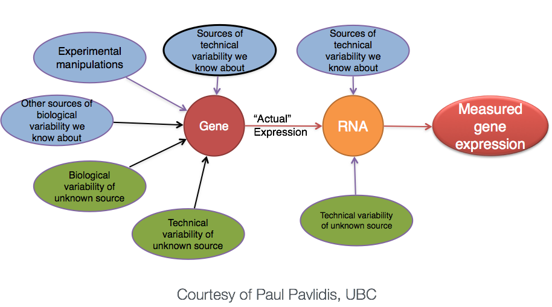
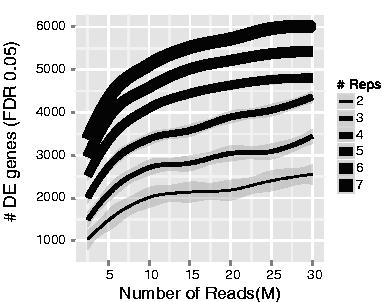

<!--- Allow the page to be wider --->
<style>
    body .main-container {
        max-width: 1200px;
    }
</style>
> # Objectives
> * Familiarity with tools and resources available through Bioconductor
> * Understanding of what DESeq2 does & why it is widely used for differential expression comparisons


# Introduction to Bioconductor

[Bioconductor](https://www.bioconductor.org/) provides open source software for the "analysis and comprehension of high-throughput genomic data", primarily through packages written in R and by . We will use a few tools that are available through Bioconductor for our analysis and highly recommend checking out [more about Bioconductor](https://www.bioconductor.org/about/), including their standards for documentation, workflow examples, and annotation resources.

# Tools for Differential Gene Expression analysis

As discussed yesterday, a common goal for RNA-seq experiments is to determine which genes are expressed at different levels between conditions. To accomplish this goal, we need to test for differential expression, using statistical approaches that are appropriate for the type of data we expect from biological data.

While there are several tools that can be used for differential expression comparisons, we use [DESeq2](https://bioconductor.org/packages/release/bioc/html/DESeq2.html) in our analysis today. DESeq2 one of two tools, along with [EdgeR](https://bioconductor.org/packages/release/bioc/html/edgeR.html), considered ['best practice'](https://bmcbioinformatics.biomedcentral.com/articles/10.1186/1471-2105-14-91) for differential expression, as both tools use similar methods that account for the distributions we expect to see for RNA-seq and are fairly stringent.

> To learn more about statistical testing and what distributions best model the behavior of RNA-seq data, a good resource is this [EdX lecture by Rafael Irizarry](https://www.youtube.com/watch?v=HK7WKsL3c2w&feature=youtu.be) or this [lecture by Kasper Hansen](https://www.youtube.com/watch?v=C8RNvWu7pAw). Another helpful guide is this [Comparative Study for Differential Expression Analysis by Zhang et al.](https://journals.plos.org/plosone/article?id=10.1371/journal.pone.0103207) from 2014.

We previously loaded several libraries into our R session. Since we loaded the library, we now we have access to information about DESeq2 within Rstudio. We can check out this out using the `?` operator.

```r
?`DESeq2-package`
```

## DESeq2 assumptions and requirements

A key consideration for RNA-Seq data is that a vast number of RNAs are represented and therefore the probability of counting a particular trasncript is small. In addition, we expect that the mean expression of any given gene is less than the variance (or spread) of expression across different samples.

Since variance is a key to both the statistical test and normalization approach used in DESeq2, if you try to compare treamtment groups with less than **two** replicates, DESeq2 will give you an error.

As a review of Day 1, what kind of sample "counts" as a replicate for DESeq2 analysis?

* **Biological replicates** are independently generated samples representing the same treatment group (i.e. RNA isolated from the kidneys of different mice) and are what is expected by DESeq2
* **Technical replicates** are generated from *the same* sample, but with technical steps replicates (i.e. two RNA preps from the same mouse kidney) and *would not* satisfy the assumptions of DESeq2, although no error would be triggered.

For most experiments biological variance is much greater than technical variance, especially if [best practices](https://www.txgen.tamu.edu/faq/rna-isolation-best-practices/) for [quality RNA isolation](https://www.biocompare.com/Bench-Tips/128790-Four-Tips-for-Perfecting-RNA-Isolation/) are followed (including DNase treatment!).

> **Note**: If you are working with cell lines and would like more detail about replicates for *in vitro* studies, this [archived page](https://web-archive-org.proxy.lib.umich.edu/web/20170807192514/http://www.labstats.net:80/articles/cell_culture_n.html) could be helpful.

A question we are frequently asked is "How many replicates do I need?"

As the below image from [Harvard Chan Bioinformatics Core](https://hbctraining.github.io/DGE_workshop/lessons/01_DGE_setup_and_overview.html) (HBC)'s training materials summarizes, there is often more contributing to our data than we expect. 

Genes can vary in expression level between samples due not only to the experimental treatment or condition but also because of extraneous sources that either cannot be or were not controlled inthe experimental design. The general goal of differential expression analysis to attempt to separate the “interesting” biological contributions from the “uninteresting” technical or extraneous contributions.





A related aspect is how much to consider sequencing depth versus additional replicates. This figure shared by Illumina in their technical talks is helpful to understand the relative importance of sequencing depth and replicate number.





Generally, sequencing depth is important for accurately measuring genes that are expressed at different abundances. For the human and mouse genomes, the general recommendation is 30-40 million reads per sample if measuring the ~20,000  protein-coding genes (i.e.: polyA library prep) to measure both highly expressed (common) and more lowly expresssed (rarer) transcripts. However, as the image above shows, replicates make a bigger impact on detecting differentially expressed genes (DEGs)

DESeq2 has some additional requirments, including the type of data expected as an input, which we will discuss later.

## DESeq2 Documentation

Since DESeq2 is both a [Bioconductor](https://www.bioconductor.org/help/package-vignettes/) tool and widely used by the bioinformatics community, there is extensive [documentation](https://bioconductor.org/packages/3.12/bioc/manuals/DESeq2/man/DESeq2.pdf) available, including [vignettes](http://master.bioconductor.org/packages/release/workflows/vignettes/rnaseqGene/inst/doc/rnaseqGene.html#preparing-count-matrices) that walk through options for analysis in greater detail than we will cover here.  

---

# Sources Used
* HBC DGE setup: https://hbctraining.github.io/DGE_workshop/lessons/01_DGE_setup_and_overview.html
* HBC Count Normalization: https://hbctraining.github.io/DGE_workshop/lessons/02_DGE_count_normalization.html
* DESeq2 standard vignette: http://bioconductor.org/packages/devel/bioc/vignettes/DESeq2/inst/doc/DESeq2.html
* DESeq2 beginners vignette: https://bioc.ism.ac.jp/packages/2.14/bioc/vignettes/DESeq2/inst/doc/beginner.pdf
* Bioconductor RNA-seq Workflows: https://www.bioconductor.org/help/course-materials/2015/LearnBioconductorFeb2015/B02.1_RNASeq.html


---

These materials have been adapted and extended from materials listed above. These are open access materials distributed under the terms of the [Creative Commons Attribution license (CC BY 4.0)](http://creativecommons.org/licenses/by/4.0/), which permits unrestricted use, distribution, and reproduction in any medium, provided the original author and source are credited.
