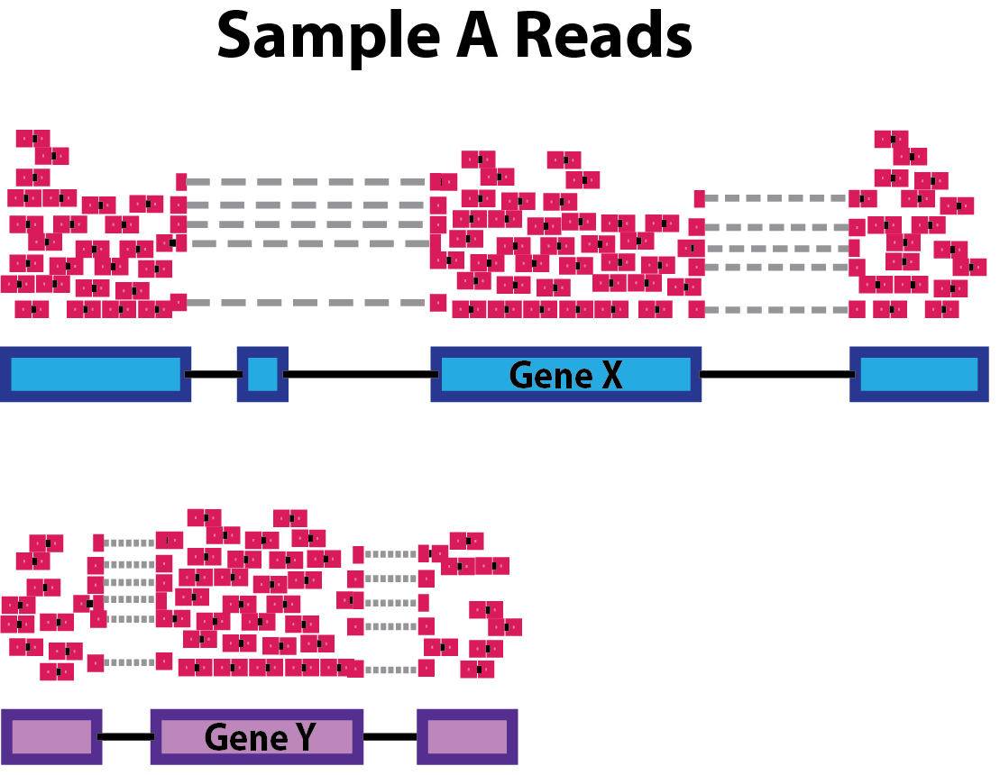
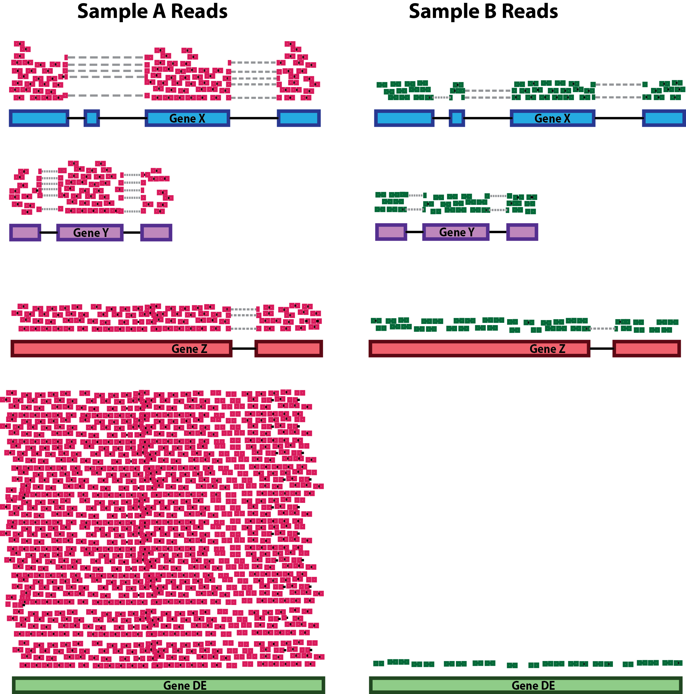

<!--- Allow the page to be wider --->
<style>
    body .main-container {
        max-width: 1200px;
    }
</style>
> # Objectives
> * Understand individual samples versus groups for comaprisons
> * Execute model fitting for differential expression comparisons


# Count normalizations

As  previously mentioned, count normalization is very important for comparing the expression of a gene between samples and/or between genes within the same sample.

Since counts of mapped reads for each gene is proportional to the expression of RNA in addition to many “uninteresting” other factors, normalization is the process of scaling raw count values to account for the “uninteresting” factors and ensure expression levels are more comparable.

## Normalization goals

Two common factors that need to be accounted for during normalization are **sequencing depth** and **gene length**. 

* **Sequencing depth** normalization is neccessary to account for the proportion of reads per gene expected for more deeply sequenced samples (like in pink below) versus a less deeply sequenced sample (like in green blow.)


*Note that each pink or green rectangle represents an aligned read, with reads spanning an intron connected by a dashed line.*
    
* **Gene length** normalization is necessary when comparing the expression between different genes, since genes of different lengths have different probablities of generating fragments that end up in the library. In the example below, both genes have similar levels of expression. However, the number of 300bp long reads that map to the longer gene (Gene X) will be much great than the number of 300bp long reads that map to the short gene (Gene Y).


    
> **Note**: The above figures are from the beginning of [one of the HBC  tutorials](https://hbctraining.github.io/DGE_workshop/lessons/02_DGE_count_normalization.html) which also include a detailed comparison of different normalization (CPM, TPM, FPKM) approaches and their best uses.

## DESeq2 normalizations

An additional consideration for normalization is **RNA composition**. A few highly differentially expressed genes, differences in the number of genes expressed between samples, or contamination are not accounted for by depth or gene length normalization methods. Accounting for RNA composition is particularly important for differential expression analyses, regardless of the tool used.



    
DESeq2 has an [internal normalization process](https://genomebiology.biomedcentral.com/articles/10.1186/gb-2010-11-10-r106) that uses the median of ratios method to normalize for sequencing depth and RNA composition prior to differential expression comparisons. However for data exploration and visualizations, it is helpful to generate an object of independently normalized counts.

For downstream quality control visualization, we will use the [rlog transformation](http://bioconductor.org/packages/devel/bioc/vignettes/DESeq2/inst/doc/DESeq2.html#count-data-transformations), which produces log2 scale data that has also been normalized to overall library size as well as variance across genes at different mean expression levels.

The rlog transformation of the normalized counts is only necessary for these visualization methods during this quality assessment. We we set `blind=TRUE` the transformation is blind to the sample information we specified in the design formula.

```r
rld <- rlog(dds, blind = TRUE)
```

```r
head(assay(rld), 3)
```

```
##             Mov10_kd_2 Mov10_kd_3 Mov10_oe_1 Mov10_oe_2 Mov10_oe_3 Irrel_kd_1
## 1/2-SBSRNA4   5.435790   5.489338   5.549466   5.522716   5.569449   5.464187
## A1BG          5.825535   5.818071   6.046747   5.988103   5.933709   5.967974
## A1BG-AS1      7.414688   7.499103   7.480435   7.432949   7.418930   7.501481
##             Irrel_kd_2 Irrel_kd_3
## 1/2-SBSRNA4   5.412841   5.538278
## A1BG          5.920751   5.884150
## A1BG-AS1      7.465922   7.433514
```


# DESeq2 Model Fitting

Before the break, we'll fit our standard model and our model that includes the patient origin covariate using the `DESeq` function and take a look at the objects we generate. 

```r
# Apply model
dds <- DESeq(dds)
```

```r
resultsNames(dds) #only includes pairwise comparison to specified control as default but other inforamtion is stored in object so can generate additional comparisons
```

```
## [1] "Intercept"                 "condition_Mov.KD_vs_Irrel"
## [3] "condition_Mov.OE_vs_Irrel"
```

```r
head(dds)
```


```r
dds_patient <- DESeq(dds_patient)
```

```r
resultsNames(dds_patient)
```

```
## [1] "Intercept"                 "patient_P2_vs_P1"         
## [3] "patient_P3_vs_P1"          "condition_Mov.KD_vs_Irrel"
## [5] "condition_Mov.OE_vs_Irrel"
```

```r
head(dds_patient)
```

Notice that with the additional covariate, additional comparisons are generated by the tool. Since we arbitrarily added the patient origin information, the `dds` object will be what we primarily use moving forward.

---

# Sources Used
* HBC DGE setup: https://hbctraining.github.io/DGE_workshop/lessons/01_DGE_setup_and_overview.html
* HBC Count Normalization: https://hbctraining.github.io/DGE_workshop/lessons/02_DGE_count_normalization.html
* DESeq2 standard vignette: http://bioconductor.org/packages/devel/bioc/vignettes/DESeq2/inst/doc/DESeq2.html
* DESeq2 beginners vignette: https://bioc.ism.ac.jp/packages/2.14/bioc/vignettes/DESeq2/inst/doc/beginner.pdf
* Bioconductor RNA-seq Workflows: https://www.bioconductor.org/help/course-materials/2015/LearnBioconductorFeb2015/B02.1_RNASeq.html


---

# Session Info

```r
sessionInfo()
```

```
## R version 3.6.1 (2019-07-05)
## Platform: x86_64-apple-darwin15.6.0 (64-bit)
## Running under: macOS Mojave 10.14.6
## 
## Matrix products: default
## BLAS:   /Library/Frameworks/R.framework/Versions/3.6/Resources/lib/libRblas.0.dylib
## LAPACK: /Library/Frameworks/R.framework/Versions/3.6/Resources/lib/libRlapack.dylib
## 
## locale:
## [1] en_US.UTF-8/en_US.UTF-8/en_US.UTF-8/C/en_US.UTF-8/en_US.UTF-8
## 
## attached base packages:
## [1] parallel  stats4    stats     graphics  grDevices utils     datasets 
## [8] methods   base     
## 
## other attached packages:
##  [1] DESeq2_1.26.0               SummarizedExperiment_1.16.1
##  [3] DelayedArray_0.12.3         BiocParallel_1.20.1        
##  [5] matrixStats_0.57.0          Biobase_2.46.0             
##  [7] GenomicRanges_1.38.0        GenomeInfoDb_1.22.1        
##  [9] IRanges_2.20.2              S4Vectors_0.24.4           
## [11] BiocGenerics_0.32.0        
## 
## loaded via a namespace (and not attached):
##  [1] bit64_4.0.5            splines_3.6.1          Formula_1.2-3         
##  [4] latticeExtra_0.6-29    blob_1.2.1             GenomeInfoDbData_1.2.2
##  [7] yaml_2.2.1             pillar_1.4.6           RSQLite_2.2.1         
## [10] backports_1.1.10       lattice_0.20-41        glue_1.4.2            
## [13] digest_0.6.25          RColorBrewer_1.1-2     XVector_0.26.0        
## [16] checkmate_2.0.0        colorspace_1.4-1       htmltools_0.5.0       
## [19] Matrix_1.2-18          XML_3.99-0.3           pkgconfig_2.0.3       
## [22] genefilter_1.68.0      zlibbioc_1.32.0        purrr_0.3.4           
## [25] xtable_1.8-4           scales_1.1.1           jpeg_0.1-8.1          
## [28] htmlTable_2.1.0        tibble_3.0.3           annotate_1.64.0       
## [31] generics_0.0.2         ggplot2_3.3.2          ellipsis_0.3.1        
## [34] nnet_7.3-14            survival_3.2-7         magrittr_1.5          
## [37] crayon_1.3.4           memoise_1.1.0          evaluate_0.14         
## [40] foreign_0.8-72         tools_3.6.1            data.table_1.12.8     
## [43] lifecycle_0.2.0        stringr_1.4.0          locfit_1.5-9.4        
## [46] munsell_0.5.0          cluster_2.1.0          AnnotationDbi_1.48.0  
## [49] compiler_3.6.1         rlang_0.4.7            grid_3.6.1            
## [52] RCurl_1.98-1.2         rstudioapi_0.11        htmlwidgets_1.5.1     
## [55] bitops_1.0-6           base64enc_0.1-3        rmarkdown_2.4         
## [58] gtable_0.3.0           DBI_1.1.0              R6_2.4.1              
## [61] gridExtra_2.3          knitr_1.30             dplyr_1.0.2           
## [64] bit_4.0.4              Hmisc_4.4-1            stringi_1.5.3         
## [67] Rcpp_1.0.5             geneplotter_1.64.0     vctrs_0.3.4           
## [70] rpart_4.1-15           png_0.1-7              tidyselect_1.1.0      
## [73] xfun_0.18
```

---

These materials have been adapted and extended from materials listed above. These are open access materials distributed under the terms of the [Creative Commons Attribution license (CC BY 4.0)](http://creativecommons.org/licenses/by/4.0/), which permits unrestricted use, distribution, and reproduction in any medium, provided the original author and source are credited.
