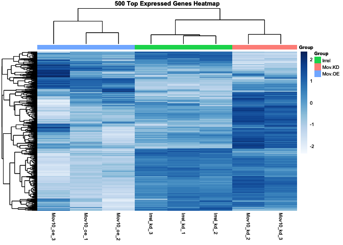
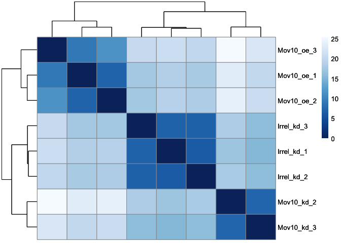
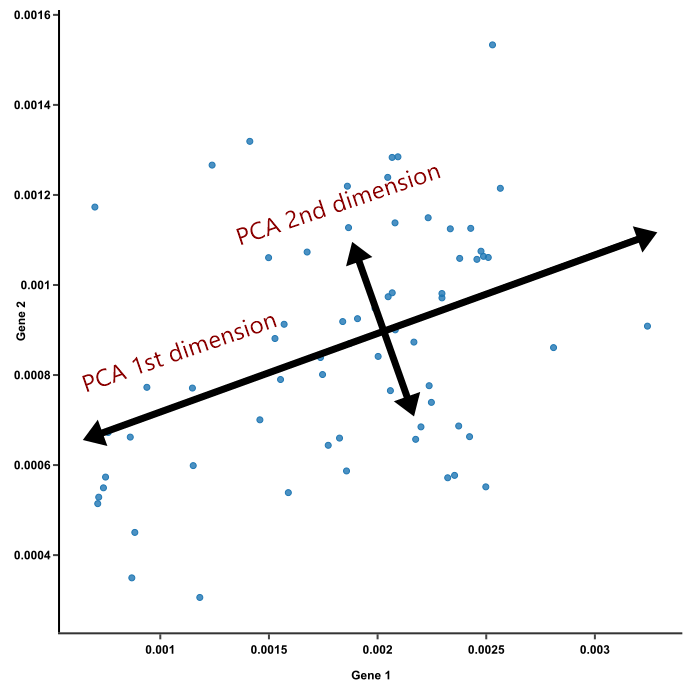
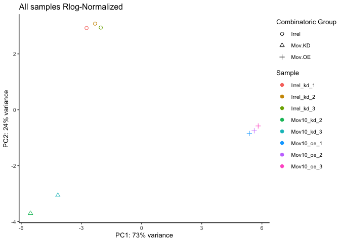
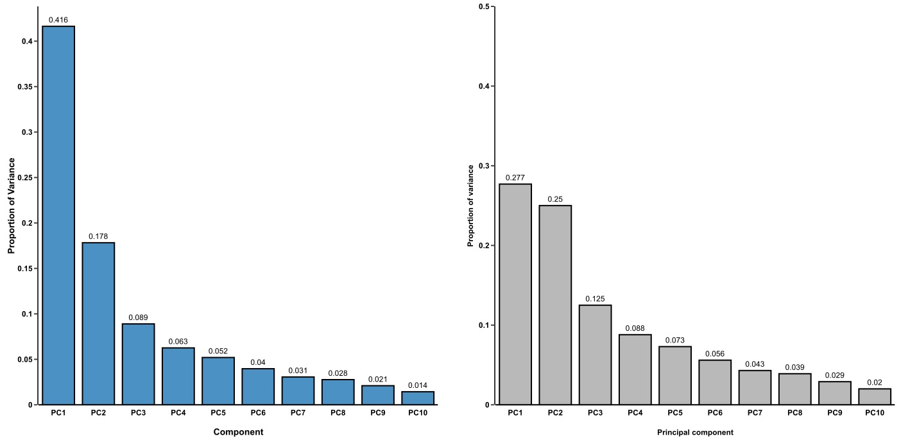
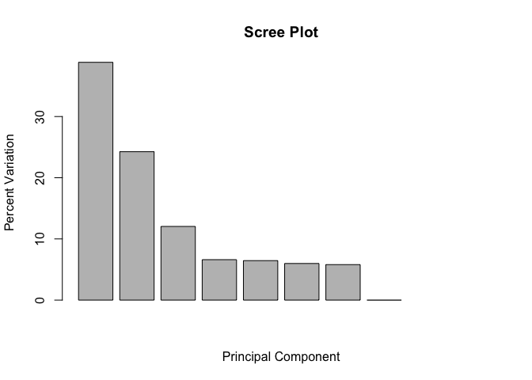
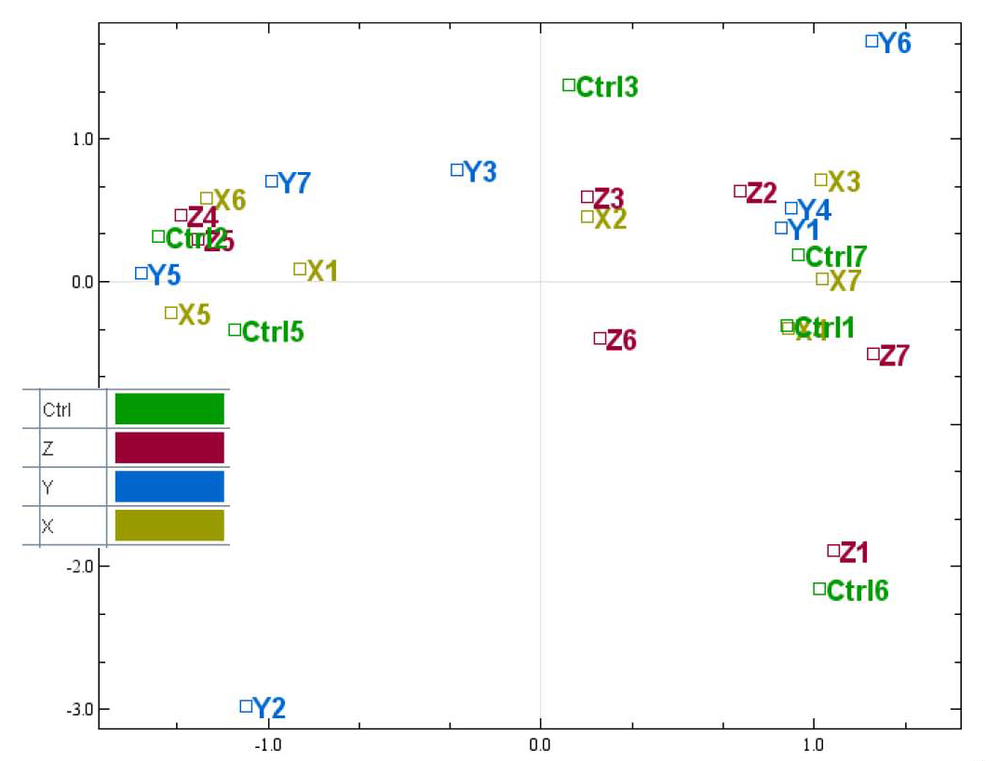
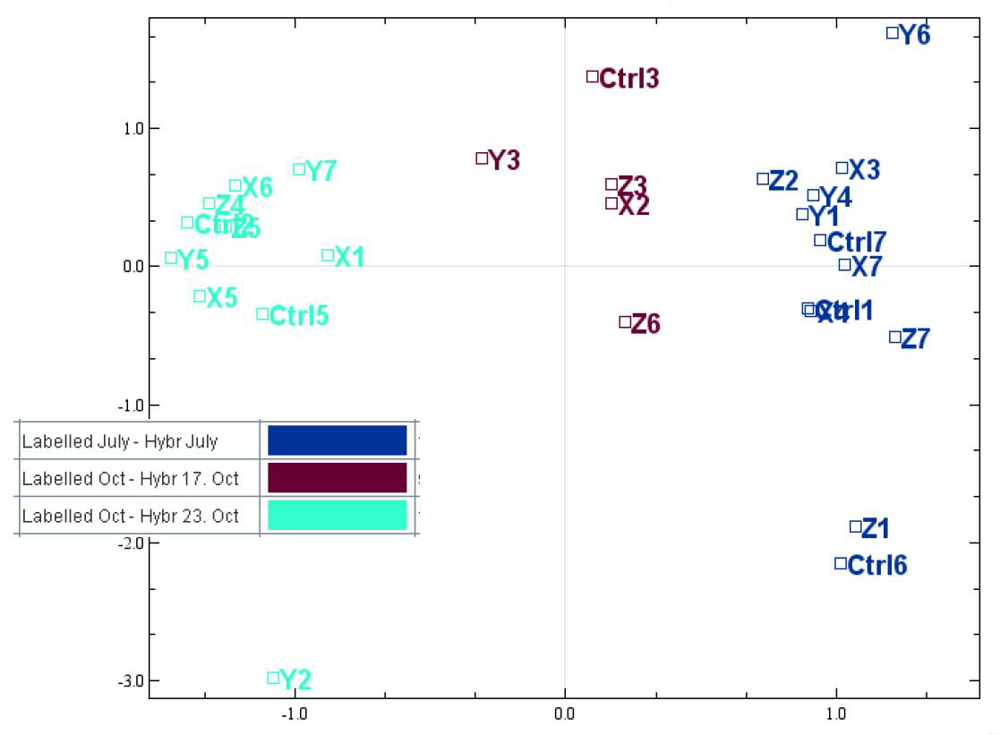

<!--- Allow the page to be wider --->
<style>
    body .main-container {
        max-width: 1200px;
    }
</style>
> # Objectives 
> * Generate common QC visualizations   
> * Understand how to interpret QC visualizations    
> * Understand when to revise the model used in the DESeq2 initialization    
> * Understand the pitfalls of post-hoc analysis     
> * Describe the causes and implications of batch effect or other QC issues in an RNA-Seq experiment     


# Sample Visualizatons for Quality Control     

Yesterday we discussed aspects of quality control assessment at the sequencing data level. Today we will outline sample-level and gene level quality controlto determine what we should expect from our downstream differential expression comparisons.

To do this, we will assess the similarity of our samples by using principal component analysis (PCA) and hierarchical clustering methods. This will allow us to determine how well patterns in the data fits our expectations from the experiments design and possible sources of variation in the dataset.

### Plot Setup

We've already loaded the libraries we need for this module. We'll follow best practices and create new directories to organize our output figures.

```r
# system("mkdir ./Figures") # create output folder if not already generated
# system("mkdir ./Figures/BySamples") # create output folder if not already generated
plotPath = "./Figures/BySamples/"
```

## Count boxplots

Next, we'll look at our distributions of raw and normalized counts. First, we need to set up some tables and labels.

```r
## setup for raw counts
pdata = data.frame(colData(dds))
mat = as.matrix(assay(dds))
title = 'Raw counts'
y_label = 'log2(counts)'
```

Then, we'll add the relevant annotations to the count table. 

```r
# create annotationn table for raw plots
annot_df = data.frame(
    sample = row.names(pdata),
    Group = factor(pdata[, "condition"]),
    row.names = row.names(pdata),
    stringsAsFactors = F
)

# join counts and annotation table
tidy_mat = tidyr::gather(as_tibble(mat), key = 'sample', value = 'counts') %>%
    left_join(annot_df, by = 'sample')
```

Once we set up the input data, we can plot the raw counts for our samples. 

```r
box_plot = ggplot(tidy_mat, aes(x = sample, y = log2(counts), fill = Group)) +
    geom_boxplot(notch = TRUE) +
    labs(
        title = title,
        x = '',
        y = y_label) +
    theme_bw() + theme(axis.text.x = element_text(angle = 90))
ggsave(filename = paste0(plotPath, "BoxPlot_Mov10_raw.pdf"), plot = box_plot, height = 8, width = 8, dpi = 300)
```

To understand how the rlog normalization impacted the distributions of counts for each sample, we can plot boxplots for the normalized data and compare that to our plot of the raw data.

```r
## rlog counts
pdata = data.frame(colData(rld))
mat = as.matrix(assay(rld))
title = 'Rlog normalized counts'
y_label = 'rlog(counts)'

annot_df = data.frame(
    sample = row.names(pdata),
    Group = factor(pdata[, "condition"]),
    row.names = row.names(pdata),
    stringsAsFactors = F
)

tidy_mat = tidyr::gather(as_tibble(mat), key = 'sample', value = 'counts') %>%
    left_join(annot_df, by = 'sample')

box_plot = ggplot(tidy_mat, aes(x = sample, y = counts, fill = Group)) +
    geom_boxplot(notch = TRUE) +
    labs(
        title = title,
        x = '',
        y = y_label) +
    theme_bw() + theme(axis.text.x = element_text(angle = 90))
ggsave(filename = paste0(plotPath, "BoxPlot_Mov10_rlog.pdf"), plot = box_plot, height = 8, width = 8, dpi = 300)
```


## Heatmaps

Next, we'll generate a heatmap of the top expressed genes across all samples. First, we'll set our color palette using a tool called [Color Brewer](https://www.r-graph-gallery.com/38-rcolorbrewers-palettes.html). 

```r
#heatmap with top 500 variant or expressed genes, rlog normalized data
colors <- colorRampPalette(brewer.pal(9, 'Blues'))(255)
```

First, we'll select the top expressed genes across all our samples to prioritize this set of genes and allow for patterns to be more easily ovbserved. 

```r
select <- order(rowMeans(assay(rld)), decreasing=TRUE)[1:500]
df <- data.frame(Group = colData(rld)[,c('condition')], row.names = rownames(colData(dds)))
```

Next, we'll set up a PDF file and plot our heatmap. Saving the plot as an object allows us to view the figure within our session as well as writing the plot to file. 

The [`pheatmap` function](https://cran.r-project.org/web/packages/pheatmap/pheatmap.pdf) does quite a lot in a single step, including scaling the data by row and clustering both the samples (columns) and genes (rows). *TODO: Add additional overview of pheatmap/heatmap function?*

>**Note**: [This blog post](https://towardsdatascience.com/pheatmap-draws-pretty-heatmaps-483dab9a3cc) has a nice step by step overview of the pheatmap options, using basketball data as an example.


```r
pdf(file = paste0(plotPath,'Heatmap_TopExp_', Comparison, '.pdf'), onefile = FALSE, width=10, height=20)
p <- pheatmap(assay(rld)[select,], scale="row",  cluster_rows=TRUE, show_rownames=FALSE, cluster_cols=TRUE, annotation_col=df, fontsize = 7, las = 2, fontsize_row = 7, color = colors, main = '500 Top Expressed Genes Heatmap')
p
```

<!-- -->


```r
dev.off()
```

```
## pdf 
##   3
```


Looking at the heatmap, we see that samples within the same treatment group cluster together, with the Mov.KD and Irrel samples on the same parent node, fitting our understanding of the experimental design. We also see clusters of genes that appear to have contrasting patterns between the treatment groups, which is promising for our differential expression comparisons.

> **Note**: Heatmaps are helpful visualizations, especially for sharing an overview of your RNA-seq data. The why and how of to use them properly can be confusing, such as outlined in the questions and answers in [this biostars post](https://www.biostars.org/p/230115/) that adds additional context to the overview in this workshop. 

#### Sample and Top Variable Expressed Heatmaps
<details>
  <summary>Click for code for additional visualizations</summary>

This [blog post](http://www.opiniomics.org/you-probably-dont-understand-heatmaps/) reviews the data transformation procedure for generating heatmaps and is a useful resource. They review the steps for generating a sample correlation heatmap similar to the plot generated below. 


```r
#heatmap of normalized data, sample distibution matrix
sampleDists <- dist(t(assay(rld))) #rld
sampleDistMatrix <- as.matrix(sampleDists) # convert to matrix
colnames(sampleDistMatrix) <- NULL

colors <- colorRampPalette(rev(brewer.pal(9, 'Blues')))(255)
pdf(file = paste0(plotPath,'Heatmap_Dispersions_', Comparison, '.pdf'), onefile = FALSE)
p <- pheatmap(sampleDistMatrix, 
         clustering_distance_rows=sampleDists,
         clustering_distance_cols=sampleDists,
         col=colors)
p
```

<!-- -->

```r
dev.off()
```

```
## pdf 
##   3
```
If we look at the `sampleDists` object, we now see from the diagonal values that the least distant samples are `Irrel_kd1_1` and `Irrel_kd_2` so these will be clustered together first, with the next closest samples `Irrel_kd_3` and `Irrel_kd_2` clustered together next.

Overall, like the heatmap of the top 500 most expressed genes, we see that samples in the same treatment groups cluster well together when the full dataset is considered.

Another informative heatmap is for the top most variably expressed genes in the dataset. An example of this code is shown below.

```r
colors <- colorRampPalette(brewer.pal(9, 'Blues'))(255)

select <- order(rowVars(assay(rld)), decreasing=TRUE)[1:500]
df <- data.frame(Group = colData(rld)[,c('condition')], row.names = rownames(colData(dds)))
pdf(file = paste0(plotPath,'Heatmap_TopVar_', Comparison, '.pdf'), onefile = FALSE, width=10, height=20)
pheatmap(assay(rld)[select,], scale="row",  cluster_rows=TRUE, show_rownames=FALSE, cluster_cols=TRUE, annotation_col=df, fontsize = 7, las = 2, fontsize_row = 7, color = colors, main = '500 Top Variably Expressed Genes Heatmap')
dev.off()
```

```
## pdf 
##   3
```

</details>

## Principle Component Analysis (PCA) Plots

A common and very useful plot for evaluating how well our samples cluster by treatment groups are Principle Component Analysis (PCA) plots. PCA is used to emphasize variation and bring out patterns in large datasets by using dimensionality redution. 

This image from
[a helpful step by step explaination of PCA](https://blog.bioturing.com/2018/06/14/principal-component-analysis-explained-simply/) helps to illustrate the principle component projections for two genes measured in approximately 60 mouse samples. Generally, this process is repeated and after each gene's contribution to a principle component or weight is determined, the expression and weight are summed across genes for each sample to calculate a value for each principle component. 



>**Note**: A more detailed overview of the PCA procedure is outlined in [a Harvard Chan Bioinformatic Core training module](https://hbctraining.github.io/DGE_workshop/lessons/principal_component_analysis.html) and is based a more thorough description presented in a [StatQuest’s video](https://www.youtube.com/watch?v=_UVHneBUBW0). Additionally, [this TowardsDataScience blog post](https://towardsdatascience.com/principal-component-analysis-3c39fbf5cb9d) goes through the math behind PCAs.

Below, we will plot the rlog normalized data for our samples projected onto a 2D plane and spanned by their first two principle components to visualize the overall effect of experimental covariates and determine if there is evidence of batch effects. 

We'll first initialize the output file.

```r
pdf(file = paste0(plotPath, 'PCAplot_rlog_', Comparison, '.pdf'), onefile = TRUE)
```

Next we'll set up the sample information and group assignments.

```r
#PCA plot for Rlog-Normalized counts for all samples
CombinatoricGroup <- factor(meta$condition)
SampleName <- factor(row.names(meta))
```

Then we'll generate the PCA projections using the `plotPCA` function from DESeq2. 

```r
p.all <- plotPCA(rld, intgroup = c('condition'), ntop = 500)
```

Next, we'll generate a customized plot using the `ggplot2` package, including shape assignments for our treatment groups and color assignments for the individual samples.

```r
gp <- ggplot(p.all$data, aes(x = PC1, y = PC2, color = SampleName, shape = CombinatoricGroup)) + xlab(p.all$labels[2]) + ylab(p.all$labels[1]) + scale_shape_manual(values=1:nlevels(CombinatoricGroup), name = 'Combinatoric Group') + geom_point(size=2) + ggtitle(label = as.character('All samples Rlog-Normalized')) + theme(plot.title = element_text(hjust = 0.5)) + guides(colour=guide_legend(nrow=12, title = 'Sample'), legend.key = element_rect(size = 1), legend.key.size = unit(0, 'cm')) + theme_classic(base_size = 10) + theme(legend.margin=margin(t = 0, unit='mm'))
plot(gp)
```

<!-- -->

```r
dev.off()
```

```
## pdf 
##   3
```

### Interpreting PCA plots

In the plot above, we see that principle component 1 (PC1) explains ~70% of the variance in our data while principle component 2 (PC2) explains ~25% of the variance. We also see that samples in each treatment group are fairly tightly grouped, with the most variance across the Mov.KD treatment group. 

This [helpful overview of PCA basics](https://blog.bioturing.com/2018/06/14/principal-component-analysis-explained-simply/) walks through both the generation and interpretatation of similar plots.    

We generally expect most of the variance to be explained by the first two or three principle components. A screeplot is a way to visualize the variance explained by each principle component. 

In these scree plot examples from BioTuring, the plot on the left fits what we would expect for a dataset with high signal from the experimental treatment, where the majority of the variance is explained by the first few principle components. The plot on the right illustrates a scenario where the variance is distributed across many components, which could be due to low signal from the experimental treatment, complex experimental design, or confounding factors.
image: 

#### Generating a ScreePlot
<details>
  <summary>Click for example code for generating a ScreePlot</summary>
  
To generate a scree plot, the PCA results need to be used independently of plotting, such as described by [this statquest post](https://statquest.org/pca-clearly-explained/) and replicated below.

```r
# generate PCA loadings
pca <- prcomp(t(assay(rld)), scale=TRUE)

## get the scree information
pca.var <- pca$sdev^2
scree <- pca.var/sum(pca.var)
barplot((scree[1:10]*100), main="Scree Plot", xlab="Principal Component", ylab="Percent Variation") 
```

<!-- -->

We can see that the majority (>75%) of the variance across our samples is explained by the first three principle components, giving us further confidence regarding the quality of our data.

</details>

#### Additional PCA plot for raw data
<details>
  <summary>Click for code for additional visualizations</summary>
  
It can sometimes be useful to also generate a PCA plot for the raw data as well as the normalized data.    

```r
pdf(file = paste0(plotPath, 'PCAplot_raw_', Comparison, '.pdf'), onefile = TRUE)
#PCA for Raw counts for all samples
RC <- SummarizedExperiment(log2(counts(dds, normalized = FALSE)), colData=colData(dds))
p.RC <- plotPCA(DESeqTransform(RC), intgroup = 'condition')
gpRC <- ggplot(p.RC$data, aes(x = PC1, y = PC2, color = SampleName, shape = CombinatoricGroup)) + xlab(p.RC$labels[2]) + ylab(p.RC$labels[1]) + scale_shape_manual(values=1:nlevels(CombinatoricGroup), name = 'Combinatoric Group') + geom_point(size=2) + ggtitle(label = as.character('All samples Raw')) + theme(plot.title = element_text(hjust = 0.5)) + guides(colour=guide_legend(nrow=12, title = 'Sample'), legend.key = element_rect(size = 1), legend.key.size = unit(0, 'cm')) + theme_classic(base_size = 10) + theme(legend.margin=margin(t = 0, unit='mm'))
plot(gpRC)

dev.off()
```

```
## quartz_off_screen 
##                 2
```

```r
# embedd example of plot (rlog only)
plot(gp)
```

<!-- -->

We see that there is less variance explained by PC1 and that the samples from the same group are not as well clustered for the raw data. Since this is prior to normalization, these differences are likely due to **technical** considerations like sequencing depth differences that are accounted for in the rlog normalization.   
</details>

### Evaulating batch effects or confounders

PCA plots are useful for evaulating the impact of factors other than the experimental treatment or group. 

At times, batch effects can be quite obvious, such as this example from the [DESeq2 vignette](http://bioconductor.org/packages/devel/bioc/vignettes/DESeq2/inst/doc/DESeq2.html), where there is clear separation within the treatment groups. 


If we color only by sequencing run type (paired-end vs. single-end), we see that PC2 (29% of variance) is primarily explained by this technical covariate. 


However, the samples are clearly seperated by experimental condition on PC1, and since PC1 explains more variance than  PC2 **and** since we have non-confounded batches, we could incorporate the technical covariate into our model design, such as outlined in the [DESeq2 vignette](http://bioconductor.org/packages/devel/bioc/vignettes/DESeq2/inst/doc/DESeq2.html#multi-factor-designs).

In experiments with more complex designs, such as when there are interesecting/multiple treatment conditions, it can be less clear what covariants are influencing expression, such as illustrated from [this documenation for a microarray analysis tool](http://www.molmine.com/magma/global_analysis/batch_effect.html).

From the PCA labeled by experimental treatment, we see that samples from the treatment group do not cluster together and that there is high variance across all treatment groups.


However, when the plot is color coded by the technical batches of probe labeling, we see that the patterns in the data are better explained by batch than the experimental conditions.


#### When to remove samples or update the design formula

The HBC training materials has a step-by-step example of evaluating [batch effects](https://hbctraining.github.io/DGE_workshop/lessons/03_DGE_QC_analysis.html) using PCAs. The [DESeq2 vignette](http://bioconductor.org/packages/devel/bioc/vignettes/DESeq2/inst/doc/DESeq2.html#multi-factor-designs) provides an overview of how to add additional covariates to a model design before refitting the DESeq2 model for a dataset.

---

# Sources Used    
* HBC QC tutorial: https://hbctraining.github.io/DGE_workshop/lessons/03_DGE_QC_analysis.html    
* Detailed Heatmap tutorial from Galaxy: https://training.galaxyproject.org/training-material/topics/transcriptomics/tutorials/rna-seq-viz-with-heatmap2/tutorial.html   
* PCA Overview: https://blog.bioturing.com/2018/06/14/principal-component-analysis-explained-simply/     


---

# Session Info:

```r
sessionInfo()
```

```
## R version 3.6.1 (2019-07-05)
## Platform: x86_64-apple-darwin15.6.0 (64-bit)
## Running under: macOS Mojave 10.14.6
## 
## Matrix products: default
## BLAS:   /Library/Frameworks/R.framework/Versions/3.6/Resources/lib/libRblas.0.dylib
## LAPACK: /Library/Frameworks/R.framework/Versions/3.6/Resources/lib/libRlapack.dylib
## 
## locale:
## [1] en_US.UTF-8/en_US.UTF-8/en_US.UTF-8/C/en_US.UTF-8/en_US.UTF-8
## 
## attached base packages:
## [1] parallel  stats4    stats     graphics  grDevices utils     datasets 
## [8] methods   base     
## 
## other attached packages:
##  [1] RColorBrewer_1.1-2          pheatmap_1.0.12            
##  [3] ggrepel_0.8.2               dplyr_1.0.2                
##  [5] tidyr_1.1.2                 ggplot2_3.3.2              
##  [7] DESeq2_1.26.0               SummarizedExperiment_1.16.1
##  [9] DelayedArray_0.12.3         BiocParallel_1.20.1        
## [11] matrixStats_0.57.0          Biobase_2.46.0             
## [13] GenomicRanges_1.38.0        GenomeInfoDb_1.22.1        
## [15] IRanges_2.20.2              S4Vectors_0.24.4           
## [17] BiocGenerics_0.32.0        
## 
## loaded via a namespace (and not attached):
##  [1] bit64_4.0.5            splines_3.6.1          Formula_1.2-3         
##  [4] latticeExtra_0.6-29    blob_1.2.1             GenomeInfoDbData_1.2.2
##  [7] yaml_2.2.1             pillar_1.4.6           RSQLite_2.2.1         
## [10] backports_1.1.10       lattice_0.20-41        glue_1.4.2            
## [13] digest_0.6.25          XVector_0.26.0         checkmate_2.0.0       
## [16] colorspace_1.4-1       htmltools_0.5.0        Matrix_1.2-18         
## [19] XML_3.99-0.3           pkgconfig_2.0.3        genefilter_1.68.0     
## [22] zlibbioc_1.32.0        purrr_0.3.4            xtable_1.8-4          
## [25] scales_1.1.1           jpeg_0.1-8.1           htmlTable_2.1.0       
## [28] tibble_3.0.3           annotate_1.64.0        farver_2.0.3          
## [31] generics_0.0.2         ellipsis_0.3.1         withr_2.3.0           
## [34] nnet_7.3-14            survival_3.2-7         magrittr_1.5          
## [37] crayon_1.3.4           memoise_1.1.0          evaluate_0.14         
## [40] foreign_0.8-72         tools_3.6.1            data.table_1.12.8     
## [43] lifecycle_0.2.0        stringr_1.4.0          locfit_1.5-9.4        
## [46] munsell_0.5.0          cluster_2.1.0          AnnotationDbi_1.48.0  
## [49] compiler_3.6.1         rlang_0.4.7            grid_3.6.1            
## [52] RCurl_1.98-1.2         rstudioapi_0.11        htmlwidgets_1.5.1     
## [55] labeling_0.3           bitops_1.0-6           base64enc_0.1-3       
## [58] rmarkdown_2.4          gtable_0.3.0           DBI_1.1.0             
## [61] R6_2.4.1               gridExtra_2.3          knitr_1.30            
## [64] bit_4.0.4              Hmisc_4.4-1            stringi_1.5.3         
## [67] Rcpp_1.0.5             geneplotter_1.64.0     vctrs_0.3.4           
## [70] rpart_4.1-15           png_0.1-7              tidyselect_1.1.0      
## [73] xfun_0.18
```

---

These materials have been adapted and extended from materials listed above. These are open access materials distributed under the terms of the [Creative Commons Attribution license (CC BY 4.0)](http://creativecommons.org/licenses/by/4.0/), which permits unrestricted use, distribution, and reproduction in any medium, provided the original author and source are credited.
